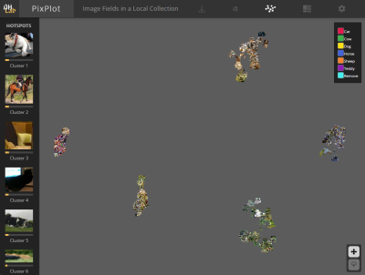

# Data Discovery Solution 🔬 


Every machine learning project requires a deep understanding of the data, to be able to understand whether the data is representative of the problem to be solved, to determine the approaches to be undertaken and indeed for the project to be successful.


Understanding of the data typically takes place during the Exploratory Data Analysis (EDA) phase. It is complex part of the project where data is attempted to be cleansed, outliers identified and the suitability of the data is assessed to inform hypothesis and experiments.

The following image illustrates the various phases, their respective complexity and roles during a typical machine learning project:


## Project goals 🎯

The Data Discovery Playbook aims to quickly provide structured views on your text, images and videos, all at scale using Synapse and unsupervised ML techniques that exploit state of the art deep learning models.

The goal is to present this data to and facilitate discussion with a business user/data owner very quickly via PowerBI visualisation, so that the customer and team can decide the next best action with the data, identify outliers or generate a training data set for a supervised model.

Another goal is to help simplify and accelerate the complex Exploratory Data Analysis phase of the project by democratising common data science functions and to accelerate your project so that can focus more on the business problem you are trying to solve.

Keep all code assets standalone and as simple as possible for quick usage or adaptation for production usage.

## Overview

The aim of this Playbook is to illustrate the usage of the tools, alongside guidance, examples and documentation to get rapid insights of your unstructed data, all of which have been applied in real customer solutions.


## Intended audience

The intended audience of this Playbook includes:

* Engineering/project leads
* Data scientists/data engineers
* Machine learning engineers
* Software engineers

## General approach for this Playbook

This Playbook provides code to quickly discover data as part of the Exploratory Data Analysis phase of the project. The overall approach is to take a large unstructured dataset that has no labels available, and to iterate over the data using a variety of techniques to aggregate, cluster and ultimately label the data in a cost effective and timely manner.

This is achieved by using unsupervised ML clustering algorithms, heuristic approaches and by direct input and validation by a domain expert. Asking questions of the data in natural language is also possible, if text based, using the semantic search feature of Azure Cognitive Search.  

By combining these approaches, structure and labels can be applied to large datasets so that the data may either be indexed for discovery via a search solution such as Azure Cognitive Search or for a supervised ML model to be trained so that future unseen data can be classified accordingly.

The following illustrates this approach at a high level for a text based problem where large amounts of unstructured data exists:

1) Cluster and explore the data quickly in the generated interactive PowerBI report
1) Ask specific questions of your data from within the Synapse notebooks using Azure Cognitive Search with Semantic search and SynapseML
1) Assess the data to determine whether some simple heuristics may be applied to classify the data with a semantically relevant term - see the Heuristics notebook
1) Apply the heuristic classification to the underlying data and remove the data from the larger corpus that could be classified
1) Run Text Clustering in the remaining data and generate Word Clouds - iterate until a ideal number of clustered data appears and the clusters make sense to a Domain Expert
1) The Domain Expert assesses the Word Clouds in more detail, and makes obvious corrections to Word Clouds by programmaticaly moving terms between clusters or using [PixPlotML](https://github.com/alexhock/pixplotml)
1) The Domain Expert assess the Concept Graph for network connectivity and relationships
1) The Domain Expert labels the clusters with a semantically relevant term which is programmatically propagated to the underlying records within the dataset
1) Merge steps 1 and 6 which now allows for a classification model to be trained

## Using PixPlotML to rapidly visualise and label data for training

[PixPlotML](https://github.com/alexhock/pixplotml) is an interactive and zoomable visualization of your whole dataset. This web-based tool, a modified version of the original Pixplot, is valuable for object detection and classification projects to perform these tasks:

1) Initial investigation and visualization of a labelled (or unlabelled) dataset.
1) Fixing incorrect classifications and removing invalid or confusing images. (Click on an image and update its label, or flag for removal)
1) Visualizing false positive bounding boxes to identify why they are occuring.
Images that look similar are located next to or near each other, making it easy to see where errors occur (in the UMap visualization).

Images that look similar are located next to or near each other, making it easy to see where errors occur (in the UMap visualization).

UMap Visualization            |  Interactive and Zoomable          |   Different Views (by label)                |
:-------------------------:|:-------------------------:|:-------------------:
  |   | 

## Hypothesis driven development and experiment tracking 🧪

Code written during EDA may not make it to production, but treating it as production code is vital as it provides an audit and represents the investment made to determine the correct ML solution as part of a [hypothesis driven development approach](https://www.thoughtworks.com/insights/articles/how-implement-hypothesis-driven-development).

This allows teams to not only reproduce the experiments but also be able to learn from past lessons learnt, saving time and associated development costs.

All Synapse notebooks contain full AML and MLFlow experiment tracking to provide lineage on data and parameters used.

## Technology used 🤖

This Playbook aims to provide similar approaches accross a variety of technologies and uses the following components:

* [Azure Synapse](https://azure.microsoft.com/en-gb/services/synapse-analytics/#overview) notebooks and Spark Pools for data processing and compute.
* [PowerBI](https://powerbi.microsoft.com/en-us/) for rapid and simple interactive data visualisation dashboards
* [OpenAI](https://learn.microsoft.com/en-us/azure/cognitive-services/openai/overview) These models can be easily adapted to your specific task including but not limited to content generation, summarization, semantic search, and natural language to code translation
* [Keras Applications](https://keras.io/api/applications/) in particular [InceptionV3](https://keras.io/api/applications/inceptionv3/) for image inference and feature extraction
* [Transformers Packages](https://huggingface.co/docs/transformers/) for feature extraction
* [BLIP model](https://huggingface.co/spaces/Salesforce/BLIP) for image captioning via visual and word transformers
* [Pegasus xsum model](https://huggingface.co/google/pegasus-xsum) for abstractive text summarisation
* [SparkML pipelines](https://spark.apache.org/docs/latest/ml-pipeline.html) for clustering techniques
* [SKLearn](https://scikit-learn.org/stable/modules/clustering.html) for clustering techniques and others
* [spaCy](https://spacy.io/) for feature extraction
* [Azure Cognitive Search](https://azure.microsoft.com/en-us/services/search/) for rapid search of the dataset
* [PixPlotML](https://github.com/alexhock/pixplotml) for rapidly visualising and labelling datasets

## Getting Started - Synapse


### If you do not have a Synapse Workspace

A new Synapse workspace and all cluster configuration and notebooks can be deployed from here.

#### Prerequisites

1) Download and install the [Azure CLI](https://docs.microsoft.com/en-us/cli/azure/install-azure-cli)

1) Download and install [jq](https://stedolan.github.io/jq/download/), a lightweight and flexible command-line JSON processor

1) Azure Data Lake Storage Gen2 storage account - The Azure Synapse workspace needs to be able to read and write to the selected ADLS Gen2 account. In addition, for any storage account that you link as the primary storage account, you must have enabled hierarchical namespace at the creation of the storage account, as described on the Create a Storage Account page. More info on creating Azure Data Lake Storage can be found [here](https://learn.microsoft.com/en-us/azure/storage/blobs/create-data-lake-storage-account)

#### Deployment steps

* Login to your Azure Subscription via ``` az login ```

* Clone the Playbook repo:

  ```bash
  git clone https://github.com/microsoft/data-discovery-toolkit

  cd data-discovery-toolkit/environment_preparation/deployment
  ```

* Rename the file `vars.sample` to `vars.env`
* Populate the required variables within the `vars.env` file:

```bash
# The resource group that your Synapse instance has been provisioned to
SynapseResourceGroup=
# The region of the Synapse Resource Group
Region=
# The ADLS Storage Account name
StorageAccountName=
# The resource group of the ADLS storage account
StorageAccountResourceGroup=
# The name of the file share within the ADLS storage account
FileShareName=
# The name of the Synapse Workspace
SynapseWorkspaceName=
# The Synapse SQL user
SqlUser=
# The Synapse SQL password
SqlPassword=
# The Azure subscription id
SubscriptionId=
```

* Run the following command:

```bash
sh deploy.sh
```

☕ Grab some coffee as it will take around 30 minutes ☕

#### ✔️ _Verifying the install_

1) Verify that your resource group contains a provisioned Synapse service
1) Verify that no permission errors are raised when launching the Synapse Workspace
1) Verify that are Apache Spark Pool cluster has been provisioned
1) Verify that packages have been installed against the cluster
1) Verify that the notebooks have been imported into a folder called `Data Discovery`
1) Verify that you can associate the Apache Spark Pool cluster with a notebook
1) Verify that a Spark session is started when executing the notebook

### If you already have a Synapse Workspace

To use the Synapse components, an [Azure Synapse Spark pool](https://docs.microsoft.com/en-us/azure/synapse-analytics/spark/apache-spark-pool-configurations) is required. Please navigate to [Synapse Environment Preparation](/environment_preparation/synapse/README.md) to configure the cluster for usage.

### To use the Azure Cognitive Search Features

To use the [Azure Cogitive Search](https://azure.microsoft.com/en-us/services/search/) functionality, a provisioned Search instance must be provisioned and ensure that [Semantic Search is enabled](https://docs.microsoft.com/en-us/azure/search/semantic-search-overview#enable-semantic-search)

## Terminology used in this Playbook 📖

* `Node` - a single infrastructure VM comprised of compute and memory
* `Cluster` - a group of nodes
* `Spark Pool` - a cluster with its associated configuration and sizing
* `Clustering` - an unsupervised machine learning technique for grouping similar records together
* `ADLS` - [Azure Data Lake Storage](https://azure.microsoft.com/en-gb/services/storage/data-lake-storage/)

## Text clustering

Refer to the [Text Clustering section](/walkthroughs/text_clustering.md) For more detailed information on clustering documents.

## Code accelerators 🚀

The following code accelerators serve as starting points to try approaches that are known to work for the data discovery phase.
**Note - these accelerators are not intended for production, they will require amendment to incorporate into a production pipeline**

| Media Type | Scenario | Description | Platform |
| -------- | ----------- | ------| ----- |
| Text Documents | [Text Clustering](/Synapse/notebooks/text_clustering/standalone_text_clustering.ipynb) | Extract features with TF-IDF and cluster documents with built in Search and interactive PowerBI report | Synapse
| Text Documents | [Text Clustering](/Synapse/notebooks/text_clustering/standalone_text_clustering_spaCy.ipynb) | Extract features with [spaCy](https://spacy.io/) and cluster documents with built in Search and interactive PowerBI report | Synapse
| Text Documents | [Text Clustering](/Synapse/notebooks/text_clustering/standalone_text_clustering_BERT.ipynb) | Extract features with [BERT](https://huggingface.co/docs/transformers/model_doc/bert) and cluster documents with built in Search and interactive PowerBI report| Synapse
| Text Documents | [Text Clustering](/Synapse/notebooks/text_clustering/standalone_text_clustering_OpenAI.ipynb) | Extract features with [Azure OpenAI](https://docs.microsoft.com/en-us/azure/cognitive-services/openai/) and cluster documents with built in Search and interactive PowerBI report | Synapse
| Text Documents | [Text Summarisation](/Synapse/notebooks/text_summarisation/standalone_text_summarisation.ipynb) | Generate abstractive text summaries with [Pegasus xsum model](https://huggingface.co/google/pegasus-xsum) with built in Search | Synapse
| Images and videos     | [Image Clustering](/Synapse/notebooks/image_clustering/standalone_image_clustering.ipynb) | Extract features from images, make an [imagenet](https://www.image-net.org/) prediction and cluster | Synapse
| Images and videos     | [Image Captioning](/Synapse/notebooks/image_captioning/standalone_image_captioning.ipynb) | Generate a caption for an image and cluster the captions with built in Search and interactive PowerBI report | Synapse

## Tips for Synapse 💡

See [Environment preparation for Synapse](/environment_preparation/synapse/README.md)

## Example walkthroughs with data 🧭

This section contains some documented common scenarios:

 Scenario | Description | Platform |
| -------- | ----------- | ----- |
[Animal Face Image Captioning and clustering](/walkthroughs/animal_faces/captioning_and_clustering/README.md) | End to end walkthrough of captioning against an animal face dataset | Synapse
[Animal Face Feature Extraction and clustering](/walkthroughs/animal_faces/feature_extraction_and_clustering/README.md) | End to end walkthrough of clustering against an animal face dataset | Synapse
| [Interactive Image Cluster dashboard](/walkthroughs/powerBI/README.md) | Setting up a dashboard from scratch in 2 minutes | PowerBI
| [BBC Sports Similarity Matrix](walkthroughs/bbc/graph_similarity.ipynb) | A notebook that illustrates how to use locality-sensitive-hashing (LSH) to create a similarity matrix. Could be useful when dealing with large amounts of text documents | Synapse
| [Image Situation dataset bias](/walkthroughs/imsitu) | A notebook that shows how to detect biases in a labeled image dataset | Synapse
| [Applying simple heuristics for classification](/walkthroughs/heuristics/standalone_text_heuristics.ipynb) | A notebook that shows how run simple search techniques to quickly get a baseline | Synapse
| [Classify BBC Sports documents with Azure OpenAI](/walkthroughs/OpenAi-classification/OpenAI-Classification.ipynb) | A notebook that shows how to use OpenAI one-shot classification to quickly get a baseline | Synapse
| [EDA with Azure OpenAI](/walkthroughs/OpenAI-EDA/BBC_OpenAI_EDA.ipynb) | A notebook that shows how to use OpenAI for EDA including OpenAI Retrieval Augmented Generation Pattern evaluation using Azure Cognitive Search, Azure Cognitive Semantic Search, Azure Synapse/Trident and evaluation, clustering and automated classification  | Synapse
| [Search Evaluation with Azure OpenAI](/walkthroughs/OpenAI-SearchEvaluator/Search_Evaluator.ipynb) | A notebook that shows how to automate queries from a dataset, build a standard, semantic and hybrid vector Azure Cognitive Search index and evaluate the different indices including the OpenAI Retrieval Augmented Generation (RAG) pattern  | Synapse

## Azure Services used in this repository

### Azure Synapse

[Azure Synapse Analytics](https://azure.microsoft.com/en-gb/services/synapse-analytics/#overview) is a limitless analytics service that brings together data integration, enterprise data warehousing and big data analytics. It gives you the freedom to query data on your terms, using either serverless or dedicated options – at scale. Azure Synapse brings these worlds together with a unified experience to ingest, explore, prepare, transform, manage and serve data for immediate BI and machine learning needs.

### PowerBI

[PowerBI](https://powerbi.microsoft.com/en-us/). Connect to and visualize any data using the unified, scalable platform for self-service and enterprise business intelligence (BI) that’s easy to use and helps you gain deeper data insight.

### Azure Cognitive Search

[Azure Cognitive Search](https://azure.microsoft.com/en-us/services/search/) is a fully managed search as a service to reduce complexity and scale easily including:

* Auto-complete, geospatial search, filtering, and faceting capabilities for a rich user experience
* Built-in AI capabilities including OCR, key phrase extraction, and named entity recognition to unlock insights
* Flexible integration of custom models, classifiers, and rankers to fit your domain-specific needs

## Other services used

[Graphframes](http://graphframes.github.io/graphframes/docs/_site/index.html) is a package for Apache Spark which provides DataFrame-based Graphs. It provides high-level APIs in Scala, Java, and Python. It aims to provide both the functionality of GraphX and extended functionality taking advantage of Spark DataFrames. This extended functionality includes motif finding, DataFrame-based serialization, and highly expressive graph queries.

The notebooks contain a basic graph implementation that can be amended to run functions such as BFS, DFS, find communities and label propagation amongst others.

## Datasets used in this repository 💾

Dataset | Description | Labels |
| -------- | ----------- | ----- |
[BBC sports](http://mlg.ucd.ie/datasets/bbc.html) | Consists of 737 documents from the BBC Sport website corresponding to sports news articles in five topical areas from 2004-2005 | Class Labels: 5 (athletics, cricket, football, rugby, tennis)

## Contributors ✨

<!-- ALL-CONTRIBUTORS-LIST:START - Do not remove or modify this section -->
<!-- prettier-ignore-start -->
<!-- markdownlint-disable -->
<table>
  <tr>
    <td align="center"><a href="https://github.com/gxjorge"><br /><sub><b>Jorge Garcia Ximenez</b></sub></a><br /></td>
    <td align="center"><a href="https://github.com/ayabel"><br /><sub><b>Aya Bellicha</b></sub></a><br /></td>
    <td align="center"><a href="https://github.com/lidaghr"><br /><sub><b>Lida Ghahremanlou</b></sub></a><br /></td>
    <td align="center"><a href="https://github.com/melmatlis"><br /><sub><b>Malvina Matlis</b></sub></a><br /></td>
    <td align="center"><a href="https://github.com/shanepeckham"><br /><sub><b>Shane Peckham</b></sub></a><br /></td>
  </tr>
  <tr>
    <td align="center"><a href="https://github.com/alyshaarshad"><br /><sub><b>Alysha Arshad</b></sub></a><br /></td>
    <td align="center"><a href="https://github.com/ivan-shaporov"><br /><sub><b>Ivan Shaporov</b></sub></a><br /></td>
    <td align="center"><a href="https://github.com/sujoysahacodes"><br /><sub><b>Sujoy Saha</b></sub></a><br /></td>
    <td align="center"><a href="https://github.com/yothikulk"><br /><sub><b>
    Jyothi Hanamant Kulkarni</b></sub></a><br /></td>
    <td align="center"><a href="https://github.com/ilyas-it83"><br /><sub><b>
    Ilyas F</b></sub></a><br /></td>
  </tr>
  <tr>
    <td align="center"><a href="https://github.com/alexhock"><br><sub><b>
    Alex Hocking</b></sub></a><br /></td>
    <td align="center"><a href="https://github.com/sweanan"><br><sub><b>
    Swetha Anand</b></sub></a><br /></td>
  </tr>
</table>

<!-- markdownlint-enable -->
<!-- prettier-ignore-end -->
<!-- ALL-CONTRIBUTORS-LIST:END -->

## Contributing

This project welcomes contributions and suggestions.  Most contributions require you to agree to a
Contributor License Agreement (CLA) declaring that you have the right to, and actually do, grant us
the rights to use your contribution. For details, visit https://cla.opensource.microsoft.com.

When you submit a pull request, a CLA bot will automatically determine whether you need to provide
a CLA and decorate the PR appropriately (e.g., status check, comment). Simply follow the instructions
provided by the bot. You will only need to do this once across all repos using our CLA.

This project has adopted the [Microsoft Open Source Code of Conduct](https://opensource.microsoft.com/codeofconduct/).
For more information see the [Code of Conduct FAQ](https://opensource.microsoft.com/codeofconduct/faq/) or
contact [opencode@microsoft.com](mailto:opencode@microsoft.com) with any additional questions or comments.

## Trademarks

This project may contain trademarks or logos for projects, products, or services.Authorized use of Microsoft
trademarks or logos is subject to and must follow 
[Microsoft's Trademark & Brand Guidelines](https://www.microsoft.com/en-us/legal/intellectualproperty/trademarks/usage/general).
Use of Microsoft trademarks or logos in modified versions of this project must not cause confusion or imply Microsoft sponsorship.
Any use of third-party trademarks or logos are subject to those third-party's policies.

## Additional References

Please refer to the following references for additional relevant material:

### Azure Cognitive Search additional links

* [Azure Search Knowledge mining](https://github.com/Azure-Samples/azure-search-knowledge-mining)
* [Azure Search Knowledge Mining Bootcamp](https://github.com/Azure/LearnAI-KnowledgeMiningBootcamp)
* [Azure Search custom skills](https://github.com/microsoft/SkillsExtractorCognitiveSearch)
