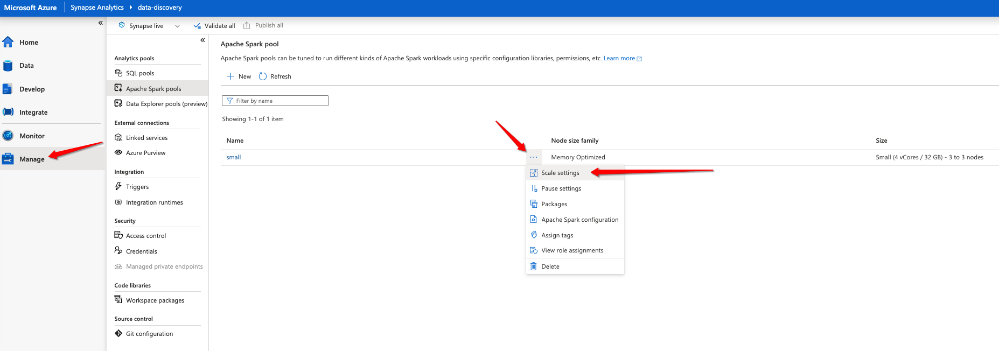
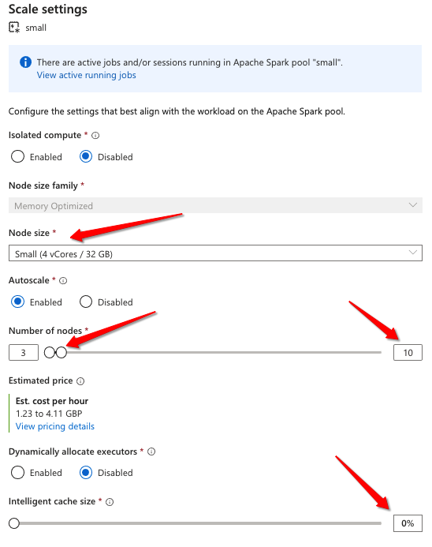
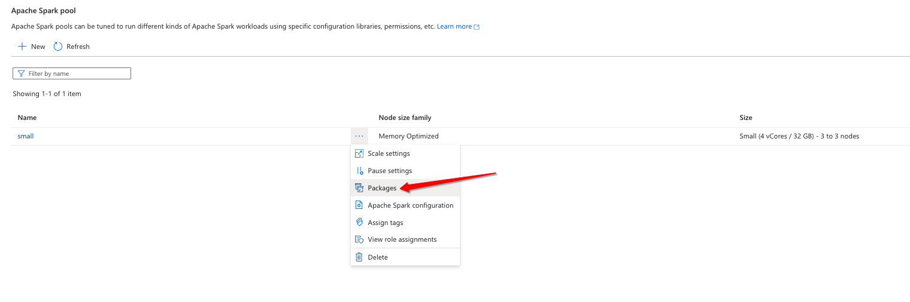
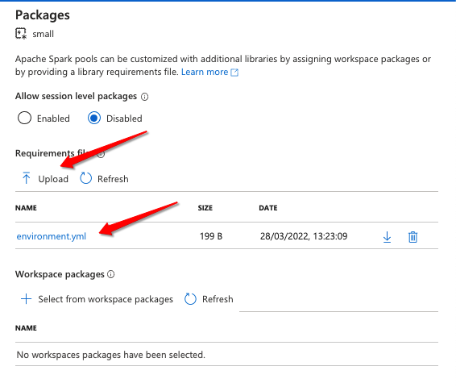
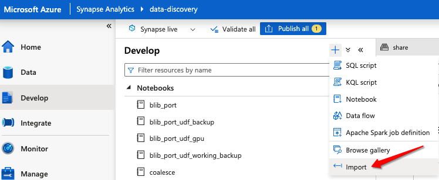
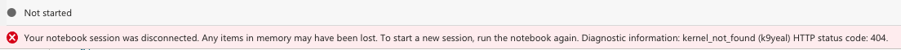
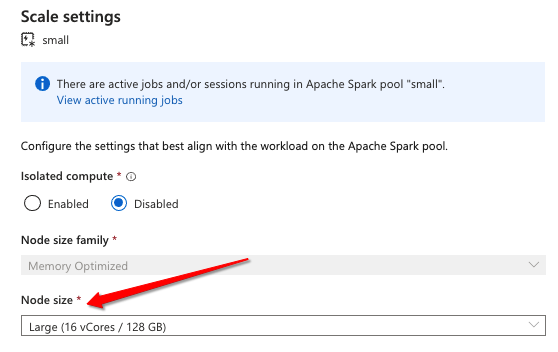
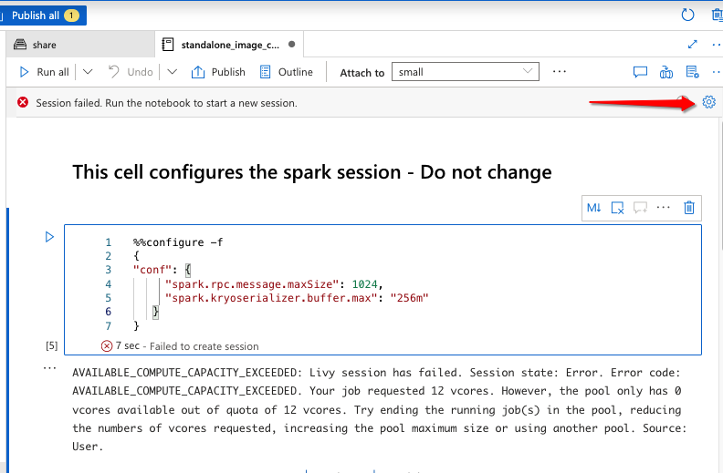
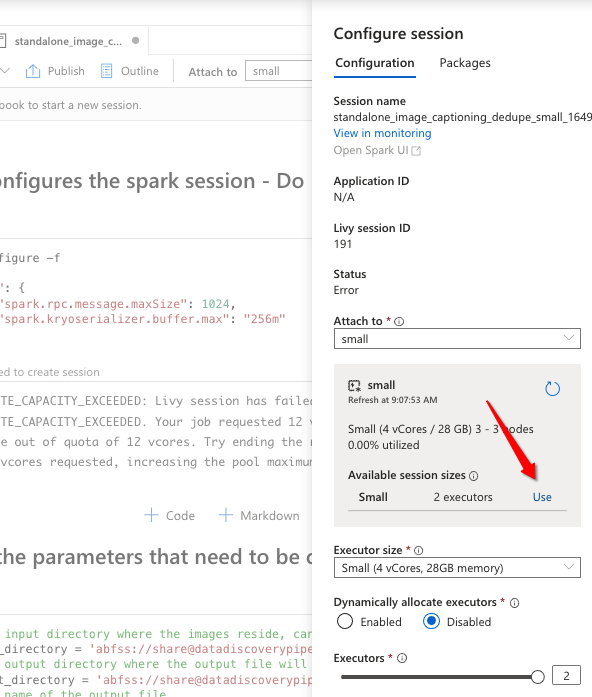
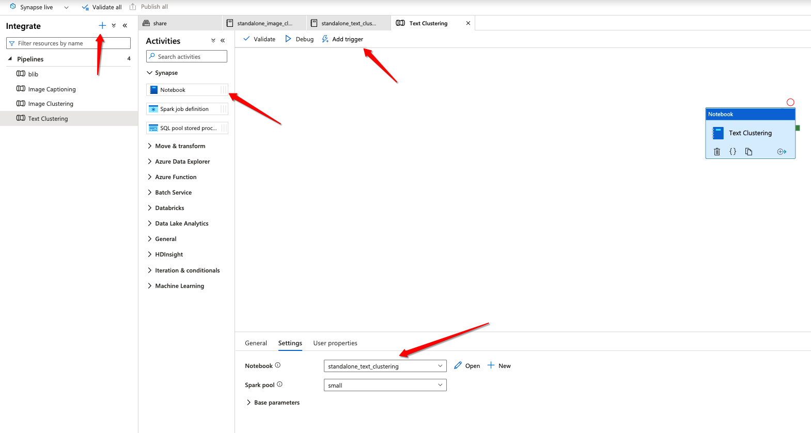

# Getting Started

## Connect to an existing Synapse instance/provision a Synapse instance

In order for the Synapse notebooks to be used within this Playbook, a [Synapse](https://azure.microsoft.com/en-gb/services/synapse-analytics/#overview) workspace needs to have been provisioned.

## Benefits of Synapse

By using Synapse, we are able to distribute our data in memory over the nodes within the Spark cluster, thus processing data in parallel and in memory is what provides us with the performance gains, particularly over larger datasets.

## Configure the size of your cluster

Navigate to the Manage blade within the Synapse workspace and configure your cluster size by selecting the horizontal ellipsis and selecting "Scale settings", see below:



The following scale settings are recommended for this Playbook:

```Node size``` - For both Standalone_Text_Clustering and Standalone_Image_clustering notebooks, a small cluster should suffice. The Standalone_Image_Captioning notebook will likely benefit from a medium sized cluster but this is dependant on the dataset size.

```Number of nodes``` - For our experiements we have been running the notebooks with 3 - 15 nodes. More nodes typically provide better performance with task durations being lowered, so scale the cluster out to a cost range that makes sense.

The estimated cost size provides clarity on the costs for the cluster.

```Intelligent cache size``` Keep this at 0 as the notebooks in their current form do not require caching.

For scale settings, see the image below:



## Additional packages

No additional packages are required for the Standalone_Text_Clustering and Standalone_Image_clustering notebooks.

### Image captioning setup

#### Install the packages required for captioning

For the [Standalone_Image_Captioning](/synapse/notebooks/image_captioning/standalone_image_captioning.ipynb) notebook, packages will need to be installed on the Spark pool. This can be achieved by navigating to the Manage blade within the Synapse workspace and selecting the horizontal ellipsis and selecting "Packages", see below:



Select the Upload button and import the [environment.yml](../Synapse/config/environment.yml) file. See the image below:



This will take around 5 - 10 minutes to install the packages and this. See the [following](https://docs.microsoft.com/en-us/azure/synapse-analytics/spark/apache-spark-azure-portal-add-libraries#:~:text=In%20Synapse%2C%20workspace%20packages%20can%20be%20custom%20or,are%20automatically%20installed%20on%20all%20Spark%20pool%20sessions.) documentation for additional information regarding package installation.

#### Upload the model config file

Upload the [med_config.json](/synapse/notebooks/image_captioning/med_config.json) to your Synapse instance primary ADLS.

## Import the notebooks

Navigate to your Synapse Workspace, select the Develop blade and select the "+" icon, and select the Import option, see below:



## Known issues running notebooks in Synapse

### Avoid using coalesce in the main notebooks

Each notebook has a parameter `LOW_MEMORY_MODE`, this should be used when dealing with large datasets or small cluster sizes. This will not perform an RDD.coalesce to a single partition when writing the output file which will push all data onto the driver node which may result in an 'Out of Memory' error.

### Notebook disconnected

If you run a notebook and you get a red ribbon across the top of the notebook stating the notebook has disconnected, chances are the cluster has run out of memory. See below:



**Mitigation**

Increase the size of the underlying machines in the cluster, see below:



Alternatively, run the notebook within a pipeline, see [Run notebooks within a pipeline](README.md#run-notebooks-within-a-pipeline)

### AVAILABLE_COMPUTE_CAPACITY_EXCEEDED

If you receive this message, chances are you are running additional sessions on your spark pool which are using resources, and the last published compute quota assigned to the notebook has been exceeded. Or you have since scaled down your cluster and and the last published compute quota assigned to the notebook has been exceeded.

**Example Error**

```AVAILABLE_COMPUTE_CAPACITY_EXCEEDED: Livy session has failed. Session state: Error. Error code: AVAILABLE_COMPUTE_CAPACITY_EXCEEDED. Your job requested 12 vcores. However, the pool only has 0 vcores available out of quota of 12 vcores. Try ending the running job(s) in the pool, reducing the numbers of vcores requested, increasing the pool maximum size or using another pool. Source: User.```

**Mitigation**

Click on the settings icon on the notebook that has failed, see below:



And then associate the available compute to the notebook by clicking "Use" and then publish, see below:



### Total size of serialized tasks is bigger than

If you receive an error that looks similar to below:

```
Job aborted due to stage failure: Total size of serialized results of 512 tasks (4.0 GiB) is bigger than spark.driver.maxResultSize (4.0 GiB)
```

This means that too much data is being sent to the driver node.

**Mitigation**

Add the following to the spark session configuration of the notebook:

```python
%%configure -f
{
"conf": {
     "spark.driver.maxResultSize": "some size in g"  # e.g. 5g
   }
}
```

### Run notebooks within a pipeline

The most stable way to run a spark notebook on a large amount of data is to create a simple pipeline with the notebook within it, this avoids notebook disconnection errors.

Navigate to the Integrate blade, select the new icon and create a pipeline. Add an item from from the Synapse --> Notebook section. Select the Notebook to run in the Settings pane and Click Add Trigger --> Trigger Now to run.

See below:

