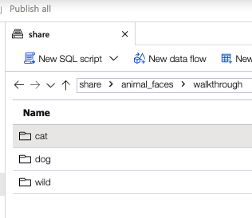
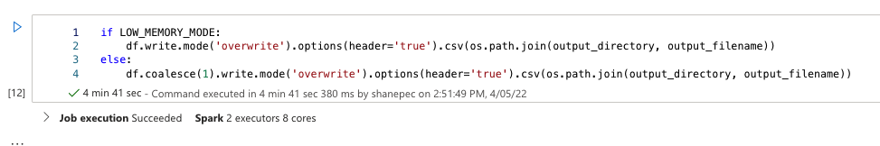
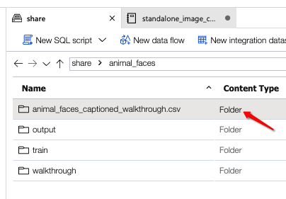
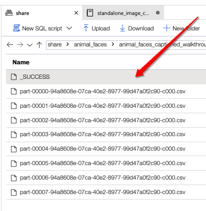
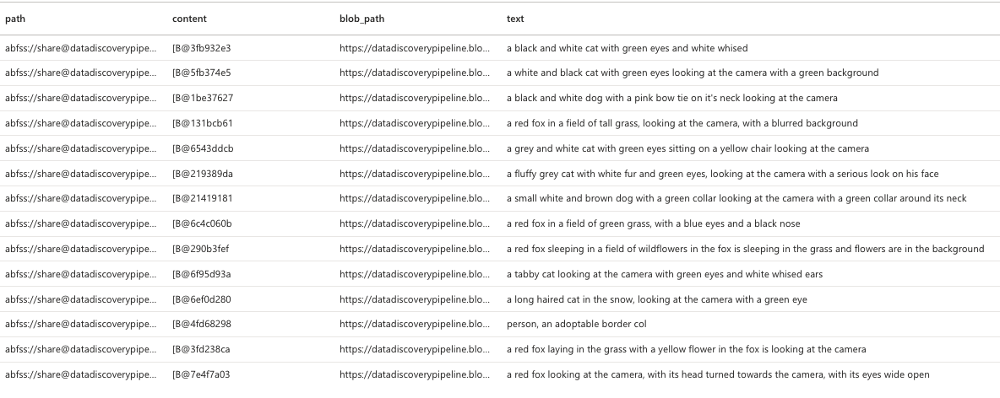
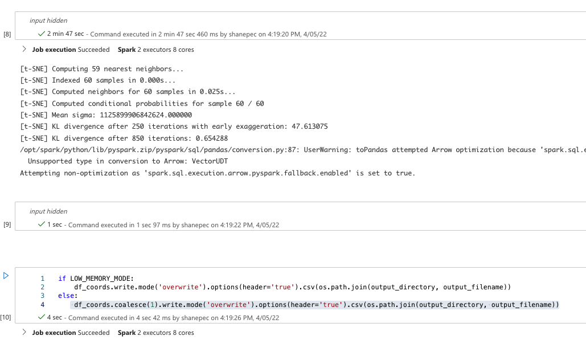

# End to end walkthrough of captioning and clustering - animal faces

In this walkthrough we will cover each step in the process to extract captions from a set of images, cluster the captions and present the final result in a [PowerBI](https://powerbi.microsoft.com/en-us/) dashboard.

For this walkthrough we will be using a sample from the [Kaggle Animal Faces dataset](https://www.kaggle.com/datasets/andrewmvd/animal-faces) which can be found [here](/data/images/animal_faces/walkthrough/).

## Upload your data

Upload the [data](/data/images/animal_faces/walkthrough/) to your primary ADLS account linked to your Synapse instance, see below:



## Run the captioning notebook in Synapse

Ensure you have followed the steps in the [Image Captioning Setup](/environment_preparation/README.md#image-captioning-setup).

Open the [Image Captioning Notebook](/synapse/notebooks/image_captioning/standalone_image_captioning.ipynb) in your Synapse instance, populate the parameters cell with the appropriate values:

```python

# The input directory where the images reside, can be nested
input_directory = 'abfss://share@[ADLS account name].dfs.core.windows.net/animal_faces/walkthrough/'
# The output directory where the output file will be written to
output_directory = 'abfss://share@datadiscoverypipeline.dfs.core.windows.net/animal_faces/'
# The name of the output file
output_filename = 'animal_faces_captioned_walkthrough.csv'

# The blob account url - https://[accountname].blob.core.windows.net
account_url = "https://[accountname].blob.core.windows.net"
# The blob account name = [accountname]
account_name = ''
# The blob account key [iufquq34r423r2==] - used to generate a SAS key
account_key = ''

# The name of the primary ADLS share
file_system_name="share"
# The directory folders where your files reside  
directory_name='animal_faces/walkthrough'  # bbc/videos

# This is the model config file which can be found in the repo at /Data-Discovery-Toolset/synapse/image_captioning/med_config.json. This needs to be uploaded to your primary ADLS linked to Synapse
model_config_file = "abfss://share@[accountname].dfs.core.windows.net/med_config.json" 

# If this is set to True then the Coalesce notebook will need to be run to merge the partition files into a single file
LOW_MEMORY_MODE = True
```

Run all the cells.

With the smallest cluster size in Synapse, namely size small and with 3 nodes, this should take around 5-7 minutes to complete, see below:



We have now generated captions for our images and written the output. However if you navigate to this output you will see that it is actually a folder. See below:



As we ran this process in `LOW_MEMORY_MODE`, we wrote an output file per Synapse Spark partition. Inspecting the contents of the folder should yield a file per partition. See below:



We now need to rewrite these files into a single file, and in a new Synapse session to avoid running out of memory on the driver node.

## Run the coalesce notebook for the image captioning output

We will now run the [coalesce notebook](/synapse/notebooks/coalesce.ipynb) which write all partition files to a single file that we can work with.

Populate the parameters cell with the appropriate values:

```python
# The input file directory and file name 
input_filename = "abfss://share@[accountname].dfs.core.windows.net/animal_faces/animal_faces_captioned_walkthrough.csv"
# The output file directory and file
output_filename = "abfss://share@[accountname].dfs.core.windows.net/animal_faces/animal_faces_captioned_single_walkthrough.csv"
```

We now have a single file that contains our image captions and should look like the image below:



## Run text clustering against the generated captions

We are now ready to cluster our images based on the generated text captions. Upload your cleansed file back into the primary Synapse ADLS storage if you cleansed the data first, otherwise use the captions file originally generated in the coalesce output step.

Navigate to the [Text Clustering Notebook](../../../synapse/notebooks/text_clustering/standalone_text_clustering.ipynb) and enter the following values in the parameters cell with appropriate values:

```python
# The input file name 
input_filename = 'abfss://share@[accountname].dfs.core.windows.net/animal_faces/cleansed/animal_faces_captioned_single_walkthrough.csv'
# The number of clusters - this can be automated or start with a guesstimate
number_of_clusters = 6
# The output directory where the output file will be written to
output_directory = 'abfss://share@[accountname].dfs.core.windows.net/animal_faces/cleansed/'
# The name of the output file
output_filename = 'animal_faces_captioned_single_clustered_walkthrough.csv'

# The blob account url - https://[accountname].blob.core.windows.net
account_url = "https://[accountname].blob.core.windows.net"
# The blob account name = [accountname]
account_name = ''
# The blob account key [iufquq34r423r2==] - used to generate a SAS key
account_key = ''

# The name of the primary ADLS share
file_system_name="share"
# The directory folders where your files reside  
directory_name='animal_faces/walkthrough'  # bbc/videos

# If this is set to True then the Coalesce notebook will need to be run to merge the partition files into a single file
LOW_MEMORY_MODE = True
```

### On setting the number of clusters

We have set the number of clusters here to be 6, twice the number of actual classes in the data. We are doing this as the captioning model extracts quite a bit more than the content of the image, including geographical and temporal information and species. Our assumption is that we will extract more insights than the simple animals present in the images.

This process should run for around 2-3 minutes on the smallest cluster and node size, see below:



## Run the coalesce notebook for the text clustering output

We will now need to run the [coalesce notebook](/synapse/notebooks/coalesce.ipynb) again which write all partition files to a single file that we can work with.

## Optional: Check the generated blob SAS keys and paths

The blob paths do not generate correctly when we work with a nested directory structure where the images are class specific folders. We would like to be able to dislay the images correctly when we display the cluster results within PowerBI.

Open the [Fix SAS Keys and paths notebook](../../../jupyter/fix_sas_keys_and_paths_synapse.ipynb) and populate the values in the parameters cell with the appropriate values:

```python
# The path and file name to your input file to be corrected
INPUT_FILE = "/Users/shanepeckham/Downloads/animal_faces_captioned_single_clustered_single_walkthrough.csv"
# The path and file name to write the corrected file to
OUTPUT_FILE = "/Users/shanepeckham/Downloads/animal_faces_captioned_single_clustered_single_walkthrough.csv"

# Value in days that we want the SAS key to be valid for
SAS_VALIDITY = 100

# Your ADLS account name
account_name = ''
# Your ADLS account key
account_key = ''

# The name of your primary ADLS share folder
file_system_name="share"
# The directory path - no trailing /
directory_name='animal_faces/walkthrough'

# The full storage path
storage_path = "https://[accountname].blob.core.windows.net/share/"
```

Run all the cells and follow the instructions in the notebook.

We now have a file with clustered captions and blob paths that we can import into PowerBI!

## Create a PowerBI report

[See how to create a simple but powerful interactive report](../../powerBI/README.md#creating-an-interactive-image-clustered-dashboard)
