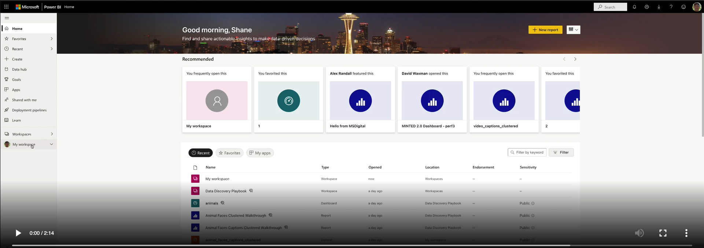

# End to end walkthrough of captioning and clustering - Istanbul scenes

In this walkthrough we will cover each step in the process to extract captions from a set of images, cluster the captions and present the final result in a [PowerBI](https://powerbi.microsoft.com/en-us/) dashboard.

For this walkthrough we will be using a sample from the [Istanbul District Data Set](https://www.kaggle.com/datasets/emirhanai/artificial-intelligence-recognit-istanbul-district) which can be found [here](/data/images/animal_faces/walkthrough/).

## Run the captioning notebook in Synapse

Open the [Image Captioning Local Notebook](/jupyter/image_captioning/standalone_image_captioning_local.ipynb) in your local conda environment:

Populate the following variables:

```python

# The input directory where the images reside, can be nested
input_directory = '/istanbul/walkthrough/'
# The output directory where the output file will be written to
output_directory = '/data/istanbul/walkthrough/output/'
# The name of the output file
output_filename = 'istanbul_captions.csv'
```

Run all the cells.

Depending on whether you have a CPU or GPU, the timing of this will obviously vary. With a CPU this should take aroun 8-10 minutes.

## Run text clustering against the generated captions

We are now ready to cluster our images based on the generated text captions.

Navigate to the [Text Clustering Notebook](../../../jupyter/text_clustering/standalone_text_clustering_local.ipynb) and enter the following values in the parameters cell with appropriate values:

```python
# The input csv file
input_filename = 'data/istanbul/walkthrough/output/istanbul_captions.csv'
# The output directory where the output file will be written to
output_directory = 'data/istanbul/walkthrough/output/'
# The name of the output file
output_filename = 'istanbul_captions_clustered.csv'
```

### On setting the number of clusters

In this example we try to calculate the cluster number using the [Elbow method](https://en.wikipedia.org/wiki/Elbow_method_(clustering)), so we start with a value of 10, but could raise or lower this if the results look wrong.

## Optional: Upload the data to your ADLS and generate SAS keys

If you want to display the images in a PowerBI report, you will need to upload the data to your ADLS account and generate SAS keys for the files.

Open the [Fix SAS Keys and paths notebook](../../../jupyter/fix_sas_keys_local.ipynb) and populate the values in the parameters cell with the appropriate values:

```python
# The path and file name to your input file to be corrected
INPUT_FILE = "/istanbul_captioned_clustered_walkthrough.csv"
# The path and file name to write the corrected file to
OUTPUT_FILE = "/istanbul_captioned_clustered_walkthrough_paths.csv"

# Value in days that we want the SAS key to be valid for
SAS_VALIDITY = 100

# Your ADLS account name
account_name = ''
# Your ADLS account key
account_key = ''

# The name of your primary ADLS share folder
file_system_name="share"
# The directory path - no trailing /
directory_name='istanbul/walkthrough'

# The full storage path
storage_path = "https://[accountname].blob.core.windows.net/share/"
```

Run all the cells and follow the instructions in the notebook.

We now have a file with clustered captions and blob paths that we can import into PowerBI!

## Optional: Check the generated blob SAS keys and paths

The blob paths do not generate correctly when we work with a nested directory structure where the images are class specific folders. We would like to be able to dislay the images correctly when we display the cluster results within PowerBI.

Open the [Fix SAS Keys and paths notebook](../../../jupyter/fix_sas_keys_and_paths.ipynb) and populate the values in the parameters cell with the appropriate values:

```python
# The path and file name to your input file to be corrected
INPUT_FILE = "/istanbul_captioned_clustered_walkthrough.csv"
# The path and file name to write the corrected file to
OUTPUT_FILE = "/istanbul_captioned_clustered_walkthrough_paths.csv"

# Value in days that we want the SAS key to be valid for
SAS_VALIDITY = 100

# Your ADLS account name
account_name = ''
# Your ADLS account key
account_key = ''

# The name of your primary ADLS share folder
file_system_name="share"
# The directory path - no trailing /
directory_name='istanbul/walkthrough'

# The full storage path
storage_path = "https://[accountname].blob.core.windows.net/share/"
```

Run all the cells and follow the instructions in the notebook.

We now have a file with clustered captions and blob paths that we can import into PowerBI!

## Create a simple PowerBI dashboard for analysis and filtering

[](https://user-images.githubusercontent.com/9840775/162421716-0d737bca-44da-43fb-af65-9581cbaeb3ef.mp4)
