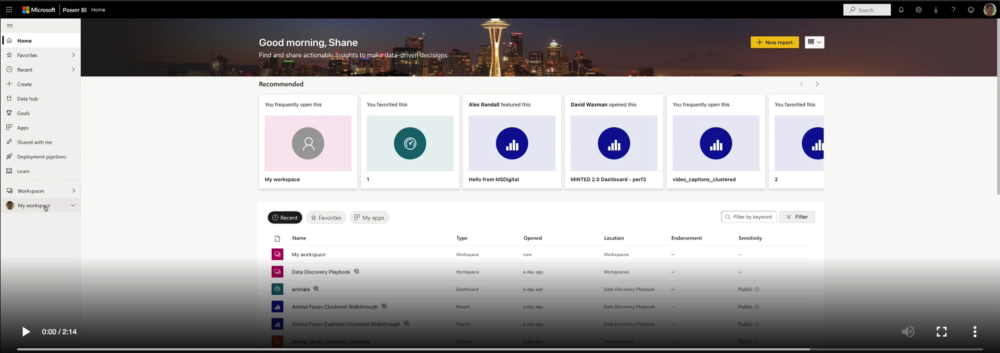
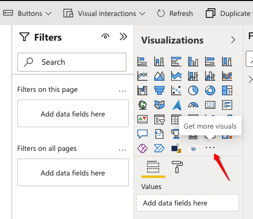
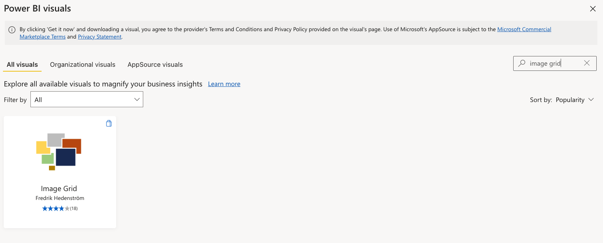

# Creating reports

If the dataset contains less than 10k records, the [PowerBI web app](https://powerbi.microsoft.com/en-us/) may be used, otherwise for larger datasets, the [PowerBI desktop app](https://www.microsoft.com/en-gb/download/details.aspx?id=58494) will be required. Unfortunately, at the time of writing the desktop app is only available on Windows.

## Creating an interactive image clustered dashboard

[](https://user-images.githubusercontent.com/9840775/162421716-0d737bca-44da-43fb-af65-9581cbaeb3ef.mp4)

**Visuals used in this report**:

```bash
Name: Scatter chart

Publisher: Microsoft

Id: scatterChart

Source: Default visual
Documentation: https://go.microsoft.com/fwlink/?linkid=2100001
```

```bash
Name: Image Grid

Publisher: Fredrik Hedenström

Id: ImageGrid_FC5183B9_926C_45E0_B5F7_0CE9EAF1DA9B

Version: 1.0.1

Source: AppSource
Support: http://www.fredrikhedenstrom.com
```

```bash
Name: WordCloud 2.0.0

Publisher: Microsoft

Id: WordCloud1447959067750

Version: 2.0.0

Source: AppSource
Support: https://community.powerbi.com
```

To add the new visuals select the "Get More Visuals" ellipsis, see below:



For example, search for Image Grid, see below:


